## Mrinal Singh Raja

Software engineer in Bengaluru. I build these because I enjoy building them — 21 apps are live right now across the web, macOS and iOS, 10 of them through Apple review, plus a community library platform running for real readers.

**Everything is free. Everywhere.** No paid tier, no subscription, no trial that expires, nothing to upgrade to. 11 of the 12 web apps do not ask for an account either — open one in a private window and it works.

**[mrinalsinghraja.github.io](https://mrinalsinghraja.github.io)** · [Full catalogue](https://www.msrx.co.in) · [App Store](https://apps.apple.com/us/developer/mrinal-singh-raja/id1879524280) · [mrinalsinghraja@gmail.com](mailto:mrinalsinghraja@gmail.com)

---

### Web — 12 apps, free, no install

  <a href="https://www.msrx.co.in">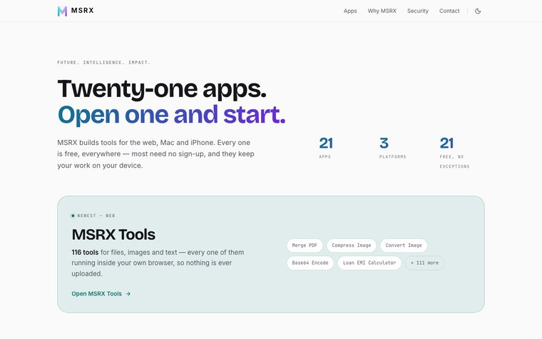</a>

The catalog — <a href="https://www.msrx.co.in">www.msrx.co.in</a>

|  |  |  |
|:--:|:--:|:--:|
| <a href="https://tools.msrx.co.in">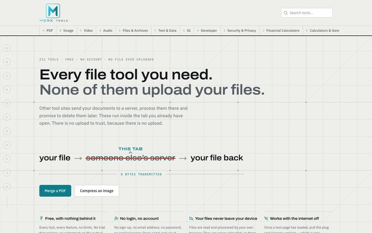</a> <a href="https://tools.msrx.co.in"><b>MSRX Tools</b></a> 211 tools, no file ever uploaded | <a href="https://lab.msrx.co.in">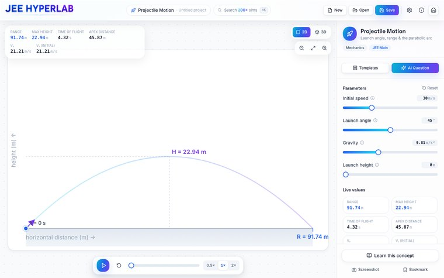</a> <a href="https://lab.msrx.co.in"><b>JEE HyperLab</b></a> 204 live PCM simulations | <a href="https://story.msrx.co.in">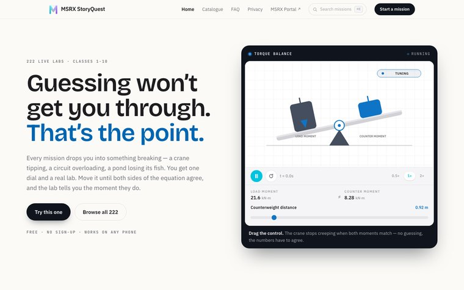</a> <a href="https://story.msrx.co.in"><b>MSRX StoryQuest</b></a> 222 STEM missions, classes 1–10 |
| <a href="https://planner.msrx.co.in">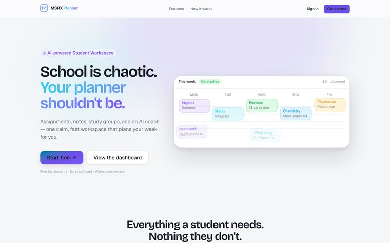</a> <a href="https://planner.msrx.co.in"><b>MSRX Planner</b></a> A student workspace that plans the week | <a href="https://weather.msrx.co.in">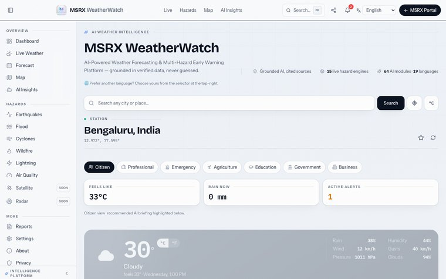</a> <a href="https://weather.msrx.co.in"><b>MSRX WeatherWatch</b></a> 15 hazard engines behind one API | <a href="https://pulsenet.msrx.co.in">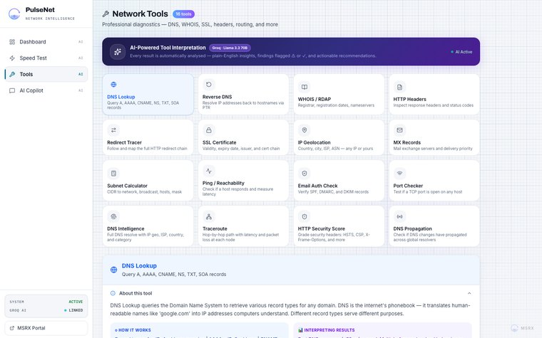</a> <a href="https://pulsenet.msrx.co.in"><b>OrionPulseNet</b></a> Speed tests and 16 network tools |
| <a href="https://cv.msrx.co.in">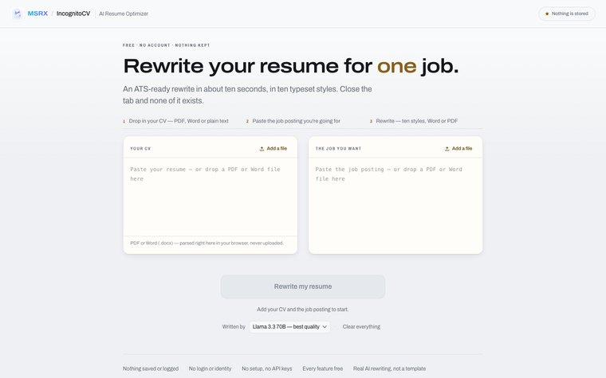</a> <a href="https://cv.msrx.co.in"><b>IncognitoCV</b></a> Score a CV without uploading it | <a href="https://graph.msrx.co.in">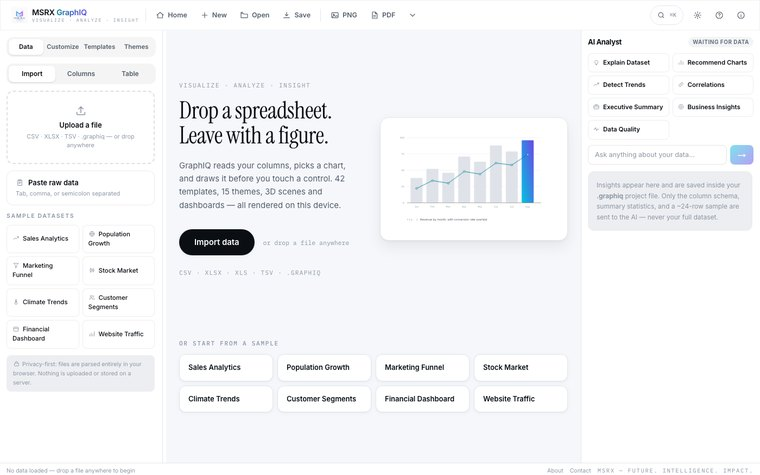</a> <a href="https://graph.msrx.co.in"><b>MSRX GraphIQ</b></a> Spreadsheet in, 2D and 3D charts out | <a href="https://canvas.msrx.co.in">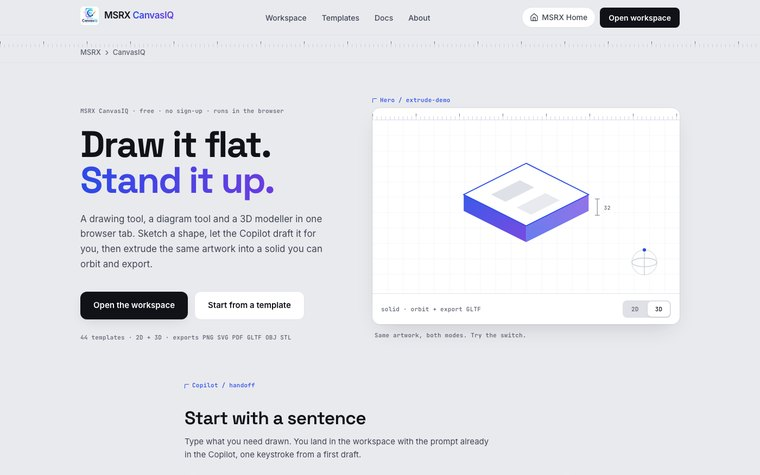</a> <a href="https://canvas.msrx.co.in"><b>MSRX CanvasIQ</b></a> Draw it flat, stand it up |
| <a href="https://qr.msrx.co.in">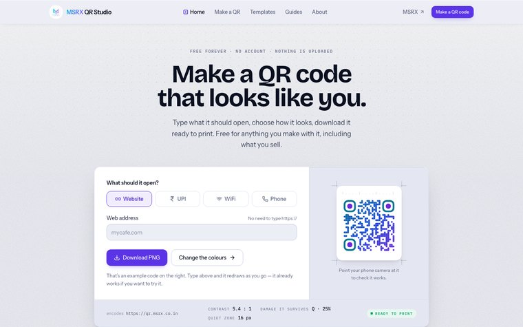</a> <a href="https://qr.msrx.co.in"><b>MSRX QR Studio</b></a> QR codes with scan-health scoring | <a href="https://meeting.msrx.co.in">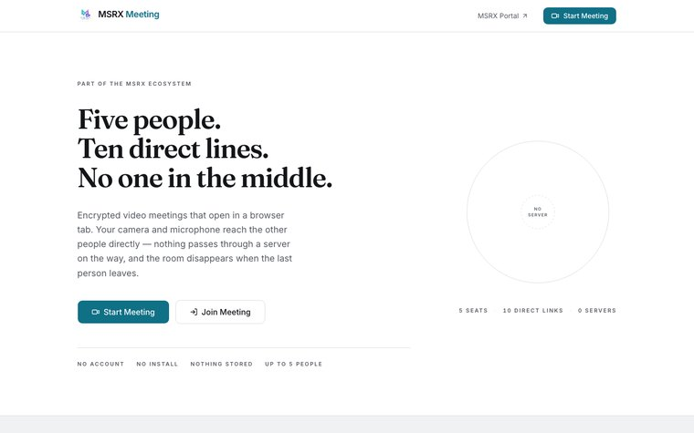</a> <a href="https://meeting.msrx.co.in"><b>MSRX Meeting</b></a> Encrypted rooms, no server in the middle | <a href="https://gantt.msrx.co.in">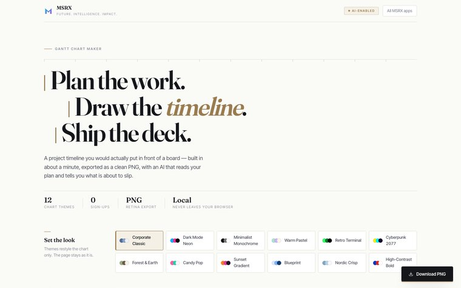</a> <a href="https://gantt.msrx.co.in"><b>Easy-Peasy Gantt</b></a> One schedule, no platform to adopt |

| App | What it does |
|---|---|
| **[MSRX Tools](https://tools.msrx.co.in)** | 211 tools for files, images, video, audio, text, money and code. No file is ever uploaded — every file tool reads it on your device. The AI writing tools are the one exception, and say so. |
| **[JEE HyperLab](https://lab.msrx.co.in)** | 204 interactive Physics, Chemistry and Maths simulations for IIT-JEE. Each is its own engine, not a template with swapped constants. |
| **[MSRX StoryQuest](https://story.msrx.co.in)** | 222 STEM missions for classes 1–10 where the answer is solved from a real equation, never authored to fit the story. |
| **[MSRX Planner](https://planner.msrx.co.in)** | An academic workspace that plans the week with the student. Offline-first — writes queue locally and reconcile on reconnect. |
| **[MSRX WeatherWatch](https://weather.msrx.co.in)** | Forecasts plus 15 independent hazard engines behind one API, with an assistant that answers in 14 languages. |
| **[OrionPulseNet](https://pulsenet.msrx.co.in)** | Speed tests, 16 network diagnostics and a copilot that reads the results. Also ships as a Mac app. |
| **[MSRX Meeting](https://meeting.msrx.co.in)** | Encrypted video rooms with live transcription. No install, no account. |
| **[IncognitoCV](https://cv.msrx.co.in)** | Matches your CV to a job description before you send it. The document stays in the browser — bring your own API key. |
| **[MSRX GraphIQ](https://graph.msrx.co.in)** | Spreadsheet in, 2D and 3D charts out. Saves to a portable file so a chart is not trapped in the tool that made it. |
| **[MSRX CanvasIQ](https://canvas.msrx.co.in)** | Drawing, diagrams and 3D with an AI copilot, in the browser. |
| **[MSRX QR Studio](https://qr.msrx.co.in)** | 21 QR types with gradients and logos, plus scan-health scoring that catches codes which would fail in the real world. |
| **[Easy-Peasy Gantt](https://gantt.msrx.co.in)** | One presentation-ready schedule without adopting a project-management platform. Single file, no framework. |

### macOS — 6 native apps, free on the Mac App Store

**[MSRX Canvas AI](https://apps.apple.com/us/app/msrx-canvas-ai/id6784137969?mt=12)** · **[OrionSeek](https://apps.apple.com/us/app/orionseek/id6770491595?mt=12)** · **[MSRX Shield](https://apps.apple.com/us/app/orionshield/id6764576967?mt=12)** · **[Orion Process Explorer](https://apps.apple.com/us/app/orionprocessexplorer/id6762134959?mt=12)** · **[MSRX Clean](https://apps.apple.com/us/app/orionclean/id6761111012?mt=12)** · **[OrionPulseNet](https://apps.apple.com/us/app/orionpulsenet/id6766838207?mt=12)**

Canvas AI runs its inference on-device through Apple's Foundation Models and Vision frameworks — nothing is uploaded and there is no API key to manage. Shield and Clean are fully sandboxed.

### iOS — 4 native apps, free on the App Store

**[GuardTrack Pro](https://apps.apple.com/us/app/guardtrack-pro/id6774895956)** — patrols, incidents and reports for security teams; checkpoints are GPS-verified and timestamped, so a completed patrol is evidence rather than a claim.
**[MSRX AI Calculator](https://apps.apple.com/us/app/numly-ai-smart-calculator/id6759639887)** — a calculator that reads expressions written in plain English.
**[MSRX PDF Compressor](https://apps.apple.com/us/app/pdfcompressor-shrink-pdf/id6759563556)** — shrinks PDFs without turning the text into pictures. Runs entirely on the phone.
**[MSRX PassportFast](https://apps.apple.com/us/app/passportfast/id6759985939)** — compliant passport and ID photos, measured rather than guessed.

---

### Community and client work

  <a href="https://library.msrx.co.in">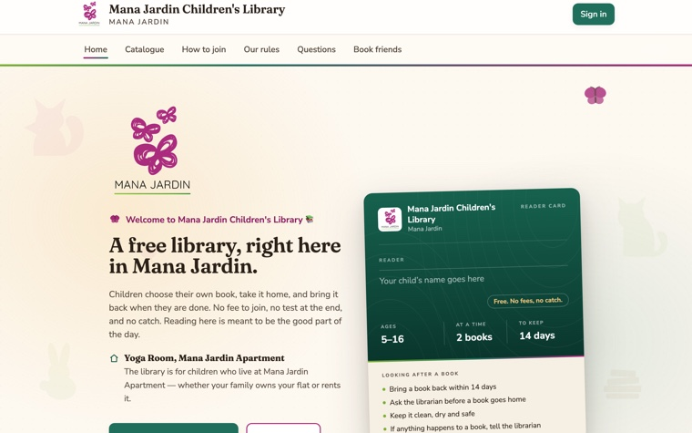</a>

**[Mana Jardin Children's Library](https://library.msrx.co.in)** — a full library platform built and running for a real community of young readers. Memberships and lending, a public catalogue with reader reviews and moderation, a donor register, visiting hours, a notice board, and an AI librarian that recommends only from books the library actually owns. Role-based access throughout, retention controls that erase fields rather than rows, and its own privacy, terms and accessibility pages. Reader records and safeguarding drove most of the design decisions. The source is open: [github.com/mrinalsinghraja/community-library](https://github.com/mrinalsinghraja/community-library).

**[Assam Association Bangalore](https://assamassociationbangalore.org)** — the website of the registered socio-cultural association of the Assamese community in Bengaluru.

**[Chinaki](https://www.chinaki.co.in)** — a digital service centre in Nagaon, Assam: GST and trade licences, factory and labour licences, tax filings, and student and employee paperwork. Seven service families and 39 services, each with a page of its own. Designed and built end to end; the owner runs and deploys it himself. The source is open: [github.com/mrinalsinghraja/chinaki](https://github.com/mrinalsinghraja/chinaki).

---

### Stack

- **Apple platforms** — Swift 6, SwiftUI, AppKit, Vision, PDFKit, Core Location, Foundation Models
- **Web** — TypeScript, Next.js, React, Tailwind CSS, Zustand, Vite
- **Data** — Postgres, Prisma, Neon, Supabase, Turso, SQLite, FastAPI, Python
- **Shipping** — Vercel, App Store Connect, GitHub Actions, Xcode

Use the platform's own frameworks. Keep the number of moving parts low. Model access sits behind a provider abstraction in every project that uses it, so a model can be swapped without touching feature code. Where a tool can do its job on the device, it does — that is harder to build and it is the right default.

---

### Open to

Collaboration, community projects, and helping someone who is stuck.

None of this is for money. There is no paid tier anywhere in it, no consulting behind it and nothing to upgrade to. I build because I enjoy it, and the good part is when someone else gets some use out of one.

If you are putting something together for a school, a library, an association or a neighbourhood, that is the kind of thing I will make time for.

---

### Is there one that should exist?

Nearly everything here began as a gap — something I went looking for, could not find, and ended up writing. So if there is a tool you keep reaching for that does not exist, describe it to me.

A genuinely useful idea is the scarce part. The building is the half I enjoy, and I would happily take it on.

**[mrinalsinghraja@gmail.com](mailto:mrinalsinghraja@gmail.com)**
